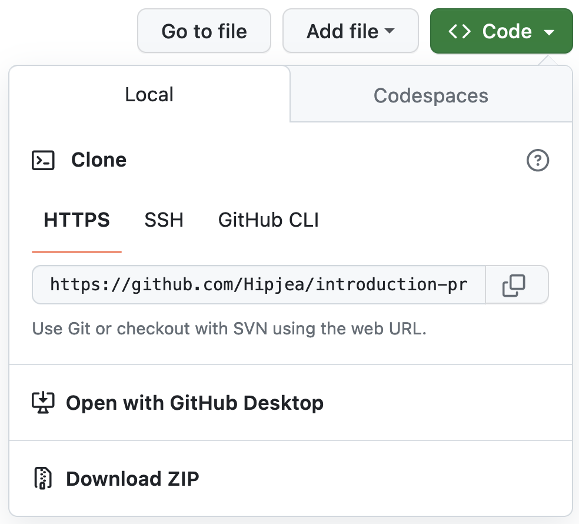
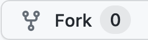

# Introduction à la programmation

Compléments au cours d'**Introduction à la programmation** du [DAEU SONATE](https://daeu-sonate.fr/).

### Comment utiliser ce dépôt ?

1. En parcourant les différents dossiers en fonction du sujet recherché.

2. En clonant le dépôt sur sa machine avec la ligne de commande `git clone https://github.com/Hipjea/introduction-programmation`

3. En téléchargeant un zip des sources via le bouton *Code > Download ZIP* :

4. En créant un fork du dépôt sur votre compte Github via le bouton *Fork* :

